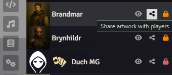

# Sidebar Buttons ⫷𝗘𝗣𝗛⫸

> **Maintained fork notice**
>
> This repository is a maintained fork of Ephaltes' original Sidebar Buttons module.
> Original project: [ephmac/show-actor-art](https://github.com/ephmac/show-actor-art)
>
> To install this fork in Foundry VTT, copy and paste this manifest URL into Foundry's "Install Module" dialog:
>
> ```text
> https://github.com/jeremyglebe/sidebar-buttons-eph/releases/latest/download/module.json
> ```

A lightweight and customizable FoundryVTT module that adds contextual buttons to the sidebar directories: Actors, Items, Journals, Macros, and Roll Tables.



## 🎯 Features

- **Personal View Button** – Displays actor or item artwork locally to the user.
- **Broadcast View Button** – Shares actor or item artwork with all connected players.
- **Permission Toggle Button** – Cycles through ownership levels (None, Limited, Observer, Owner) for actors, items, and journals.
- **Roll Button** – Rolls directly from a Roll Table entry in the sidebar.
- **Run Macro Button** – Instantly executes macros from the Macros directory.
- **Settings Panel** – Choose which buttons are visible per directory and per role (GM/Player).

All buttons are optional and configurable through a simple settings interface.

## 🌐 Localization

Translated into:
- 🇬🇧 English
- 🇵🇱 Polish
- 🇩🇪 German (chat GPT)
- 🇫🇷 French (chat GPT)
- 🇪🇸 Spanish (chat GPT)
- 🇵🇹 Portuguese (chat GPT)
- 🇷🇺 Russian (chat GPT)
- 🇨🇳 Simplified Chinese (chat GPT)
- 🇯🇵 Japanese (chat GPT)

## 👨‍💻 Credits

Created by **Ephaltes** 
Icons used from [Font Awesome](https://fontawesome.com/) and the Foundry UI.

## 💬 Feedback

Found a bug or have a suggestion? Join my Discord channel:  
🔗 https://discord.gg/9p9jsVmv
